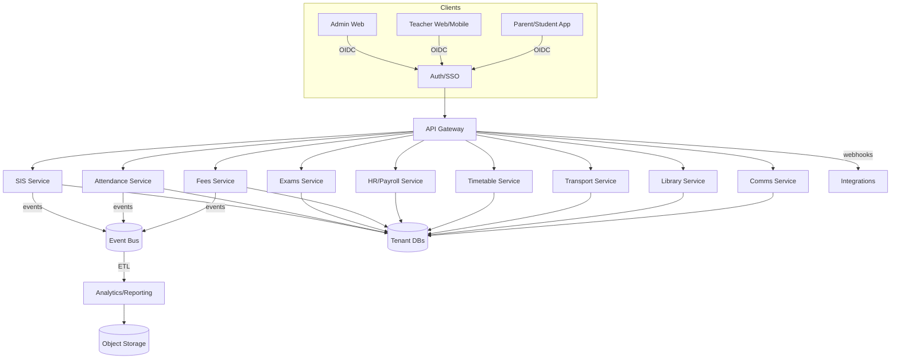

# System Architecture — Paramarsh SMS

## System Context
- Multi-tenant SaaS for K-12 schools. Tenants are schools or groups.
- Web (admin/teacher) and mobile (teacher/student/parent) clients.
- Core services: Authentication/SSO, SIS, Attendance, Exams, Fees, HR/Payroll, Timetable, Transport, Library, Communications, Analytics.
- Integrations: Payments (Razorpay/Stripe), SMS/Email/Push, SSO (Google/Microsoft), RFID/Biometrics, GPS, Accounting (Tally/QuickBooks).

## Deployment
- Containerized microservices behind an API Gateway and WAF; per-tenant schema sharding.
- Managed Postgres cluster; Redis for cache/queues; S3-compatible object storage.
- Observability: logs, metrics, traces via centralized stack.

## Security
- Zero trust between services with mTLS; secrets in vault; short-lived tokens; least privilege.

## Data Ownership & Residency
- Tenant isolation enforced at DB and application layers; regional deployments for EU/India.
