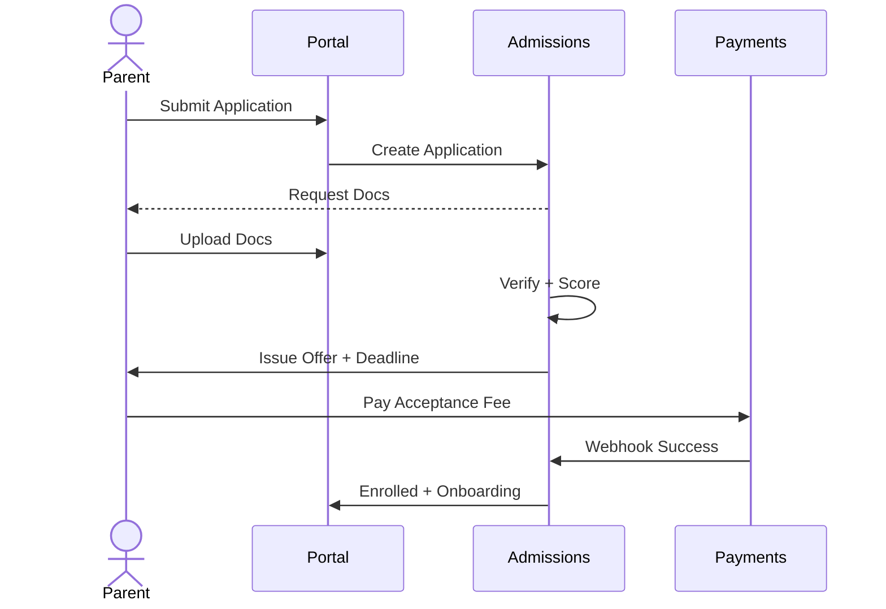

# Admissions & Enrollment — Detailed Spec

## Overview
End-to-end lifecycle from lead to enrolled student with offers, waitlist, fee acceptance, onboarding.

## Data Entities
- Program(id, name, gradeRange, seats, priorityRules)
- Application(id, tenantId, programId, studentProfileRef, status[pending,verified,offered,accepted,waitlisted,rejected,withdrawn], score, priorityTag, createdAt)
- Document(id, applicationId, type, url, status)
- Offer(id, applicationId, expiresAt, feeInvoiceId, token, status)

## UI Screens
- Parent: Apply, Upload Docs, Track Status, Accept Offer, Pay Fee, Checklist
- Admissions Officer: Pipeline Kanban, Candidate Profile, Doc Verification, Scoring, Offer Create, Waitlist, Reports

## User Flows

## APIs
- POST /api/v1/admissions/applications
- GET /api/v1/admissions/applications/{id}
- POST /api/v1/admissions/applications/{id}/documents
- POST /api/v1/admissions/applications/{id}/offer
- POST /api/v1/admissions/offers/{offerId}/accept

## Permissions
- Parent: create/read own
- Admissions Officer: read/write all; export
- Admin: override, configure programs

## Validations & Edge Cases
- Duplicate applicant detection by name+DOB+guardian+phone
- Offer expiry auto-waitlist promote
- Document redaction for PII on exports

## Notifications
- Offer issued, expiring soon, accepted
- Missing documents reminders

## Reports
- Funnel conversion; seat utilization; priority impact

## Acceptance Criteria
- Issue offers in bulk with templates and expiry
- Payment acceptance updates status to Enrolled within 2 minutes of webhook
- Full audit log of status changes

## Non-Functional
- P95 < 400ms fetch; bulk ops scalable to 5k apps/day

## Checklist
- RBAC configured
- Webhook signature verification
- Export with redaction

## Tickets
- ADM-1: Parent Application Form (SP: 5)
- ADM-2: Doc Upload & Verification workflow (SP: 8)
- ADM-3: Scoring & Priority Rules (SP: 8)
- ADM-4: Offer Generation & Expiry (SP: 5)
- ADM-5: Acceptance Fee Payment Integration (SP: 8)
- ADM-6: Waitlist Auto-Promotion Job (SP: 5)
- ADM-7: Reports & Exports (SP: 5)
