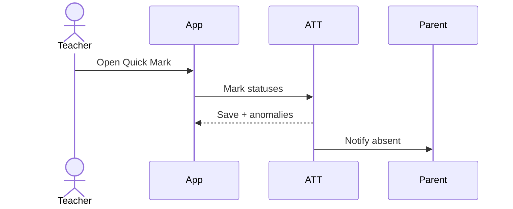

# Attendance — Detailed Spec

## Overview
Daily and period-wise attendance with alerts and imports.

## Data Entities
- AttendanceRecord(id, studentId, date, periodId?, status[P,A,L,E], reason, markedBy, source[manual,rfid,biometric,import])
- AttendancePolicy(id, threshold, alertRules)

## UI Screens
- Teacher: Today’s Classes, Quick Mark (list/grid), Seating Plan, Edit, Sync Status
- Admin: Summary, Defaulters, Imports, Policies
- Parent/Student: Daily Status, History

## Flows

## APIs
- POST /api/v1/attendance/sections/{sectionId}/periods/{periodId}
- GET /api/v1/attendance/students/{studentId}?from&to
- POST /api/v1/attendance/import

## Permissions
- Teacher: own sections; Admin: all

## Validations
- Prevent duplicate mark; override with reason

## Reports
- Heatmaps, defaulters, trends

## Acceptance Criteria
- Mark 40 students under 60s (P95)
- Offline-first with conflict resolution

## Checklist
- Alert throttling; retry-safe imports

## Tickets
- ATT-1: Teacher Quick Mark UI (SP: 8)
- ATT-2: Period-wise API & Storage (SP: 8)
- ATT-3: Alerts Engine (SP: 5)
- ATT-4: Imports (RFID/Biometric) (SP: 5)
