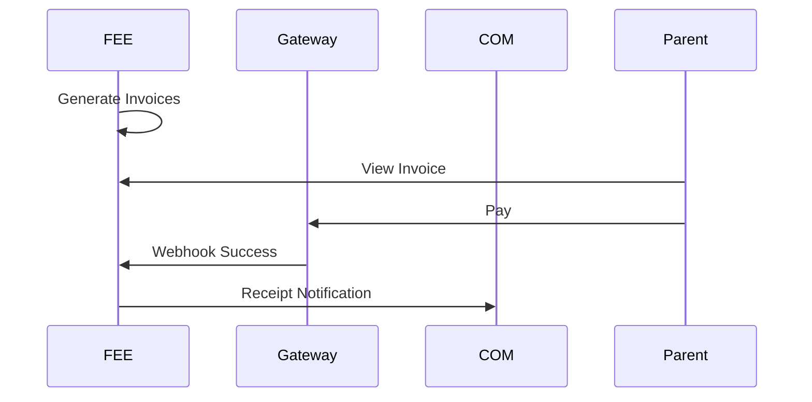

# Fees & Finance — Detailed Spec

## Overview
Configure fee structures, invoice, collect payments, reconcile.

## Data Entities
- FeeComponent(id, name, type, amount, slabRef)
- FeeStructure(id, gradeId, components, concessions)
- Invoice(id, studentId, period, dueDate, items[], status)
- Payment(id, invoiceId, gateway, amount, status, reference, method)
- DunningRule(id, cadence, channels)

## UI Screens
- Finance: Fee Setup, Invoices (list/detail), Collect Payment, Dunning, Reconciliation, Refunds, Reports
- Parent: Invoice List/Detail, Pay, Receipts

## Flows

## APIs
- POST /api/v1/fees/structures
- POST /api/v1/fees/invoices/generate
- GET /api/v1/fees/invoices/{id}
- POST /api/v1/fees/invoices/{id}/pay
- POST /api/v1/fees/webhooks/gateway

## Permissions
- Finance: all; Admin: configure; Parent: own

## Validations
- No PAN storage; signature verification; idempotency keys

## Acceptance Criteria
- Reconciliation report matches gateway settlements within 1%
- Dunning suppression on payment

## Tickets
- FEE-1: Fee Structure Config (SP: 8)
- FEE-2: Invoice Generation (SP: 8)
- FEE-3: Payment Integration (SP: 13)
- FEE-4: Dunning Engine (SP: 8)
- FEE-5: Reconciliation & Reports (SP: 8)
