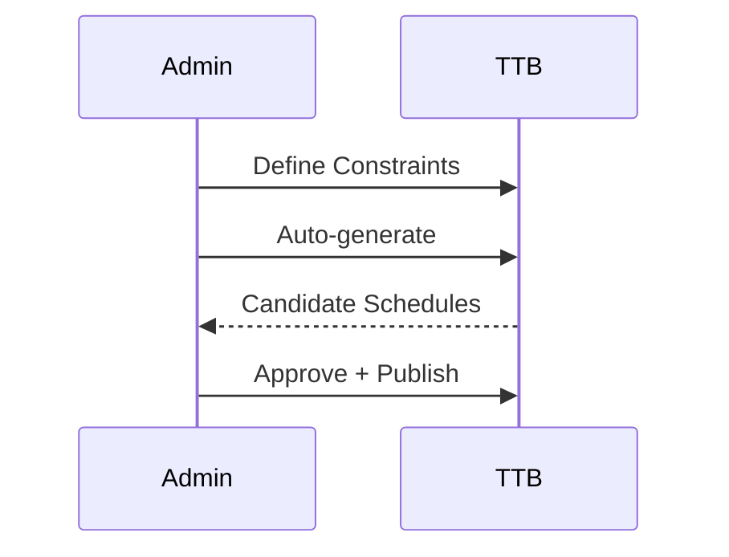

# Timetable & Scheduling — Detailed Spec

## Overview
Constraints-based scheduling and daily operations.

## Data Entities
- Constraint(id, type, value)
- Timetable(id, sectionId, weekPattern)
- ClassPeriod(id, timetableId, subjectId, teacherId, roomId, dayOfWeek, start, end)
- Substitution(id, classPeriodId, reason, substituteTeacherId)

## UI Screens
- Admin: Constraint Config, Auto-Schedule, Timetable View, Substitutions
- Teacher: My Timetable; Request Swap
- Student/Parent: Timetable View

## Flows

## APIs
- POST /api/v1/timetable/constraints
- POST /api/v1/timetable/auto-generate
- GET /api/v1/timetable/sections/{sectionId}
- POST /api/v1/timetable/periods/{periodId}/substitution

## Acceptance Criteria
- Generate within 5 minutes for 50 sections
- Manual override without breaking constraints report

## Tickets
- TTB-1: Constraints Engine (SP: 13)
- TTB-2: Auto-Scheduling (SP: 13)
- TTB-3: Substitution Workflow (SP: 8)
