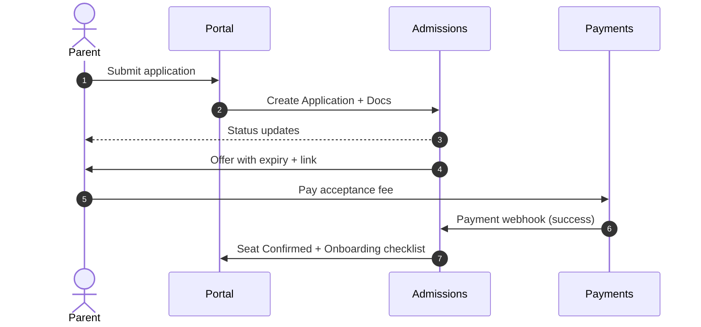
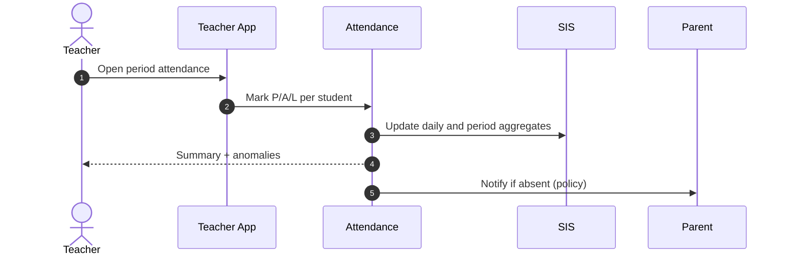
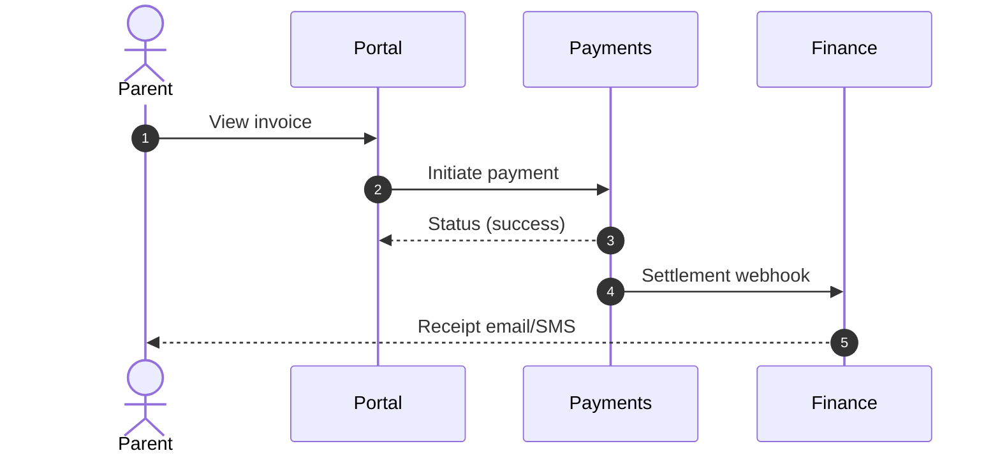
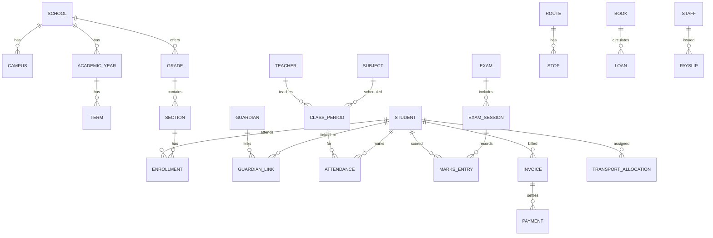

# Paramarsh School Management System (SMS) — Product Requirements Document (PRD)

Version: 1.0
Owner: Product (Paramarsh)
Last Updated: $(date +%Y-%m-%d)
Status: Draft for review

## 1. Executive Summary
Paramarsh SMS is a modern, secure, multi-tenant School Management System that unifies admissions, student information, academics, attendance, examinations, fees, finance, HR/payroll, library, transport, hostel, inventory, communications, health, discipline, and analytics across K-12 schools (single or groups). It provides role-based web and mobile experiences for students, parents, teachers, staff, and administrators; integrates with Google Workspace/Microsoft Entra, payments, SMS/Email providers, biometrics, GPS, and accounting; and ensures compliance (FERPA, GDPR, COPPA, India DPDP Act 2023) with robust security, auditability, and data governance.

- Goals: Centralize operations, improve learning outcomes and compliance, increase fee realization, reduce administrative overhead, provide actionable insights.
- Non-Goals: Full-fledged LMS parity with specialized platforms; full ERP-grade accounting (we integrate); national exam administration.
- Success KPIs (12 months):
  - Increase on-time fee collection by 15%.
  - Reduce average student/period attendance marking time by 50%.
  - 99.9% monthly availability; <300ms P95 for key APIs.
  - 90%+ adoption across staff; 70%+ monthly active parents.

## 2. Personas and Access
- Student (K-12)
- Parent/Guardian
- Teacher (Subject), Homeroom Teacher, HOD
- Principal / School Admin
- Admissions Officer
- Finance/Accounts
- HR/Payroll
- IT Admin
- Transport Manager
- Librarian
- Health/Clinic Nurse
- Counselor / Discipline Officer
- Super Admin (Group of Schools)

Access is governed by RBAC with ABAC extensions (e.g., only homeroom teacher can mark attendance for their section).

## 3. Scope and Modules

### 3.1 Core Master Data
- Academic Year/Terms/Semesters; Grades/Standards; Sections; Subjects; Periods; School Calendar/Holidays.
- Staff and Student unique IDs; roll numbers; enrollment states; guardian relationships.
- Multi-school hierarchy and shared datasets; configurable naming/numbering schemas.

### 3.2 Admissions & Enrollment
- Lead capture (web forms, CSV import), application stages, document uploads, verification, scoring, seat allocation, waitlist, offer letters, fee acceptance, onboarding checklist.
- Application portal for parents; status tracking; communications; fee payment integration; seat blocking with deadlines.
- Data migration for mid-year transfers; TC generation; sibling/ALUMNI priority.

### 3.3 Student Information System (SIS)
- Student profile: demographics, addresses, guardians, emergency contacts, health flags, IEP, language, house.
- Academic history, transcripts, conduct; digital documents vault; consent records.
- Bulk operations: promote, transfer, assign sections, generate roll numbers.

### 3.4 Attendance
- Daily and period-wise attendance; biometric/RFID import; mobile quick-mark; seating plan view; thresholds and auto-alerts.
- Excusal and leave requests; approvals; late/early departure capture.
- Reports: daily summary, trends, heatmaps, defaulters; export.

### 3.5 Academics & Curriculum
- Curriculum mapping: objectives, units, lesson plans; resources linkage.
- Assignments/homework with submissions and grading rubrics.
- Gradebooks: grade scales, weightages, moderation, re-evaluation.

### 3.6 Assessments & Examinations
- Exam types (formative, summative, unit tests, term exams); schedules; rooms; invigilation; seating; hall tickets.
- Question banks, blueprinting, paper generation; OMR support; online exams with basic proctoring (optional).
- Marks entry workflows; moderation; result publishing; report cards; transcripts; CBSE/ICSE/State boards alignment; GPA calculation.

### 3.7 Timetable & Scheduling
- Constraints-based scheduling: teacher availability, room capacity, subject periods, no back-to-back constraints.
- Auto-generate timetable; manual overrides; substitution/cover management; change notifications.

### 3.8 Fees & Finance
- Fee structures: components (tuition, transport, hostel, lab), slabs, concessions, scholarships, late fee rules, ad-hoc charges.
- Invoicing cycles; payment methods (UPI, cards, net banking, bank transfer, cash), payment gateways (Razorpay/Stripe); settlements; refunds.
- Receivables dashboard; dunning; defaulters; no-dues; ledger; export to accounting (Tally/QuickBooks); audit trails.

### 3.9 HR & Payroll
- Staff profiles; contracts; attendance/leave; shifts; qualifications; background verification records.
- Payroll components: earnings/deductions; pay schedule; arrears; increments; loans/advances; payslips.
- Statutory (India): PF/ESI/PT, TDS; Form 16; FBP; region-specific rules.

### 3.10 Transport
- Vehicles, drivers, attendants; routes; stops; timings; capacities; allocations; stop changes.
- GPS tracking integrations; student bus attendance via RFID; transport fees; incident reporting.

### 3.11 Library
- Catalog (ISBN, Dewey), acquisitions, vendors; circulation (issue/return/renew/reserve); fines; RFID/barcode; inventory; weeding.

### 3.12 Hostel/Boarding
- Hostels; rooms; occupancy; allocations; mess plans; attendance; hostel fees; visitor logs.

### 3.13 Inventory & Procurement
- Materials, suppliers, purchase requests, approvals, PO, GRN, stock, issues/returns, stock audits.

### 3.14 Communication & Notifications
- Templates, campaigns; transactional alerts (attendance, fees due, exam results); channels (SMS, email, push, WhatsApp where allowed);
- Opt-in/consent; rate limits; delivery status; translation.

### 3.15 Health, Counseling, Discipline
- Clinic visits; medications; immunizations; allergies; care plans; emergency contacts.
- Counseling notes; case management with permissions.
- Discipline incidents; actions; restorative steps; demerit tracking.

### 3.16 LMS-lite & Integrations
- Basic content sharing; assignments; quizzes; grading sync with gradebook.
- LTI 1.3/Deep Link optional; SCORM import optional.
- SSO (Google Workspace, Microsoft Entra); OneRoster 1.1 export; payment gateways; SMS/email; biometrics; GPS; accounting.

### 3.17 Portals & Apps
- Admin console (web), Teacher portal/app (web + mobile), Student portal/app, Parent portal/app.

### 3.18 Analytics & Dashboards
- KPI library: attendance trends, cohort performance, fee collection health, assessment analytics, staff utilization.
- Prebuilt dashboards; ad-hoc pivots; exports; governance on PII.

## 4. Detailed Epics and Acceptance Criteria (selected)

### 4.1 Admissions — Offer & Fee Acceptance
- As Admissions Officer, I can generate seat offers with expiry and fee links.
- Acceptance criteria:
  - Offer shows program, fee summary, deadline; unique token link.
  - Payment completes via gateway and updates seat status to Confirmed.
  - If expired, waitlist auto-promote based on priority rules.

### 4.2 Attendance — Period-wise Marking
- As Teacher, I can mark attendance for my scheduled period on mobile within 60 seconds for 40 students.
- Acceptance criteria:
  - P95 marking flow completes under 60s; offline cache with later sync.
  - Late entries and excusals supported; audit log kept.

### 4.3 Exams — Report Card Generation
- As Admin, I can generate term report cards with school branding and publish to parent portals.
- Acceptance criteria:
  - Configurable templates; grading scale; comments; signatures.
  - Recompute after moderation; lock on publish; PDF export.

### 4.4 Fees — Dunning & Defaulters
- As Finance, I can schedule reminders and view defaulters.
- Acceptance criteria:
  - Multi-channel reminders; suppression after payment; daily digest.
  - Aging buckets; export to CSV; remarks on promises-to-pay.

### 4.5 HR/Payroll — Payslip
- As Staff, I can securely view/download my payslip.
- Acceptance criteria:
  - RBAC ensures only self-access; masking sensitive IDs; audit log; watermark.

(Full epic/story backlog is provided in Appendix A.)

## 5. Key Workflows (Mermaid Sequence)







## 6. Data Model (ER Diagram)



Primary keys use UUIDv4. PII stored separately where possible. Soft deletes for auditability.

## 7. APIs
- Style: REST (JSON) with predictable resource URIs; idempotent PUT/PATCH; HATEOAS optional. Webhooks for payments, admissions.
- Auth: OAuth 2.0/OIDC for portals; service-to-service via JWT with short-lived tokens; SSO via Google/Microsoft.
- Versioning: `/api/v1` with deprecation policy (6 months).
- Pagination: cursor-based default; limit caps; filtering; sorting.
- Rate limits: per-tenant and per-IP; exponential backoff guidance.

Example endpoints:
- `POST /api/v1/admissions/applications`
- `POST /api/v1/fees/invoices/{invoiceId}/pay`
- `POST /api/v1/attendance/sections/{sectionId}/periods/{periodId}`
- `GET /api/v1/exams/{examId}/report-cards`
- `GET /api/v1/analytics/attendance?from=...&to=...`

## 8. Security, Privacy, Compliance
- RBAC + ABAC; least-privilege; SoD for finance vs. admin.
- Encryption: TLS 1.2+ in transit; AES-256 at rest; key rotation; tokenization for payment artifacts; no PAN storage.
- Data minimization; consent tracking; parental controls for COPPA (<13).
- Compliance controls: FERPA (student records), GDPR (EU), India DPDP Act 2023 (DPIA, consent, DPO where required), COPPA; data subject rights (access, rectification, deletion where lawful), audit logs; data residency (India/EU); breach notification playbook.
- Backups: encrypted, daily + point-in-time (where supported); RPO 15m, RTO 2h for critical services.
- Audit & Monitoring: immutable audit logs; admin actions; access reviews quarterly.

## 9. Non-Functional Requirements (SLOs)
- Availability: 99.9% monthly for core modules; maintenance windows communicated.
- Performance: P95 < 300ms for read APIs; P95 < 800ms for write; mobile attendance flow < 60s for 40 students.
- Scalability: 50k students per tenant; 500 concurrent teacher sessions; horizontal scaling.
- Storage: Sharded by tenant; PII vault; attachments via object storage with signed URLs.
- Observability: structured logs, metrics, traces; anomaly alerts; dashboards.

## 10. Integrations
- SSO: Google Workspace, Microsoft Entra (Azure AD).
- Payments: Razorpay (India), Stripe (global); webhooks with signature verification.
- SMS: Twilio, Gupshup; Email: SES/SendGrid; WhatsApp via approved BSP where compliant.
- Biometric/RFID: CSV/SFTP and API adapters.
- GPS/Transport: partner APIs and file imports.
- Accounting: Tally (India), QuickBooks (global) via exports or APIs.
- Standards: OneRoster 1.1 export/import for SIS data.

## 11. Analytics & Reporting
- Prebuilt dashboards and KPIs with role-based visibility; cohort analytics; longitudinal trends.
- Exports (CSV, XLSX, PDF); scheduled reports; data warehouse connectors (Snowflake/BigQuery) optional.

## 12. Deployment, Environments, CI/CD
- Envs: dev, staging, prod; feature flags; migrations via managed tools.
- CI: unit, integration, end-to-end tests; SAST/DAST; dependency scanning; IaC validation.
- Release: blue/green or rolling; canary for heavy modules (fees, attendance).

## 13. Rollout & Change Management
- Pilot with 1-2 schools; training for staff; migration plan (SIS and finance data); hypercare 4 weeks.
- Documentation: role-based guides, videos; in-app tours.

## 14. Risks & Mitigations
- Data privacy breaches → strict access controls, encryption, audits, vendor DPAs.
- Resistance to change → training, phased rollout, champions.
- Payment failures → retries, multiple gateways, robust reconciliation.
- Scheduling complexity → manual override and hybrid scheduling.

## 15. Roadmap
- MVP (3 months): Core SIS, Attendance, Basic Exams/Report Cards, Fees (invoicing + payments), Communications, Portals, SSO, Analytics v0.
- v1 (6 months): Timetable, HR/Payroll v1, Transport, Library, Admissions full, advanced report cards.
- v1.5 (9 months): Hostel, Inventory/Procurement, OMR/Online exams, Accounting integrations, Advanced Analytics.
- v2 (12+ months): Auto-scheduling optimization, LTI integrations, Data warehouse connectors, ABAC policies UI.

## 16. Glossary
- SIS: Student Information System
- OMR: Optical Mark Recognition
- RBAC/ABAC: Role/Attribute Based Access Control
- HOD: Head of Department
- UDISE+: Unified District Information System for Education (India)

---

## Appendix A — Detailed Backlog (selected highlights)

### Admissions
- Lead import (CSV, API); scoring rules; sibling/ALUMNI priority; waitlist auto-promo.
- Documents: configurable list, per-program; verification workflows.
- Approvals and SLAs; audit log of status changes.

### Attendance
- Bulk daily marking; period-wise; biometric imports; thresholds; alerts.
- Reports: per-student, per-section, per-grade; heatmaps; export.

### Exams & Grades
- Term setup; grading scales; weightages; moderation; re-evaluation; transcripts.
- Report cards with templates; publish workflows; parent portal access.

### Fees
- Structures, concessions, invoicing, payment links, reminders, settlement reconciliation, refunds.

### HR/Payroll
- Staff onboarding; leaves; payroll runs; payslips; statutory; reports.

### Transport
- Routes/stops; GPS; bus attendance; incident reporting; transport fees.

### Library
- Cataloging; circulation; fines; inventory; RFID/barcode.

### Health/Discipline/Counseling
- Clinic visits; care plans; incidents; counseling records with limited access.

### Analytics
- Attendance KPIs; fee realization; assessment analytics; staff utilization dashboards.

## Appendix B — Sample JSON Schemas

```json
{
  "$schema": "https://json-schema.org/draft/2020-12/schema",
  "$id": "https://paramarsh.example/schemas/student.schema.json",
  "title": "Student",
  "type": "object",
  "properties": {
    "id": { "type": "string", "format": "uuid" },
    "firstName": { "type": "string" },
    "lastName": { "type": "string" },
    "dateOfBirth": { "type": "string", "format": "date" },
    "gender": { "type": "string", "enum": ["male", "female", "other", "prefer_not_to_say"] },
    "guardians": {
      "type": "array",
      "items": { "type": "string", "format": "uuid" }
    },
    "enrollments": {
      "type": "array",
      "items": { "type": "string", "format": "uuid" }
    }
  },
  "required": ["id", "firstName", "lastName"]
}
```

## Appendix C — RBAC Matrix (excerpt)

| Module | Action | Student | Parent | Teacher | HOD | Admin | Finance |
|---|---|---|---|---|---|---|---|
| Attendance | Read own | ✓ | child | ✓ | ✓ | ✓ | — |
| Attendance | Create/Update | — | — | own sections | dept | all | — |
| Fees | Read | own | child | — | — | all | all |
| Fees | Create/Update | — | — | — | — | — | all |
| Exams | Read | own | child | own sections | dept | all | — |

