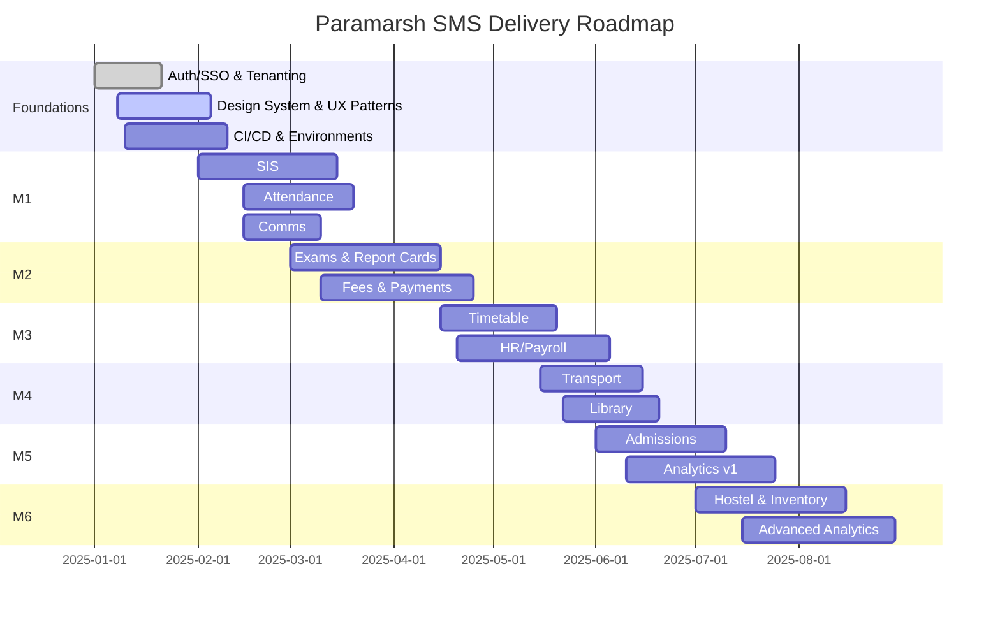

# Project Plan — Paramarsh SMS

## Delivery Milestones
- M0: Foundations (Auth/SSO, Tenanting, Design System, CI/CD)
- M1: Core SIS + Attendance + Communications
- M2: Exams/Report Cards + Fees/Payments
- M3: Timetable + HR/Payroll
- M4: Transport + Library
- M5: Admissions + Analytics v1
- M6: Hostel + Inventory + Advanced Analytics

## High-Level Gantt

## Team & RACI
- Product: requirements, prioritization, acceptance
- Engineering: architecture, implementation, quality
- Design: UX, UI system, usability
- QA: test strategy, automation, UAT
- DevOps: CI/CD, infra, SRE

## Risks & Mitigations
- Scheduling complexity → fallback manual override, phase constraints
- Payment reliability → retries, dual gateway, reconciliation
- Data migration → pilot, scripts, verification checklist
