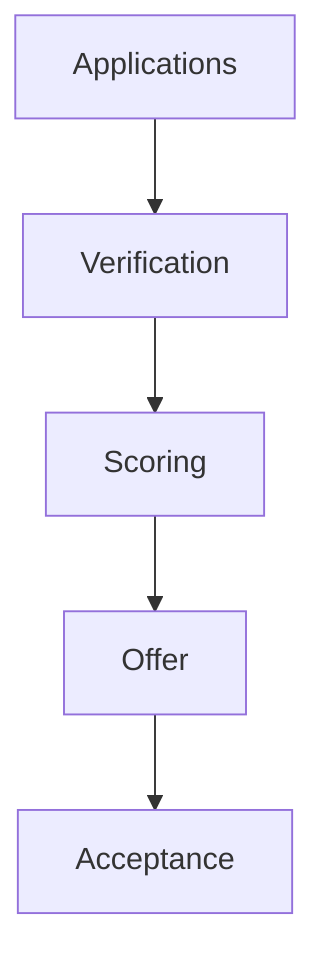

# Wireframe — Admissions Pipeline (Officer)



Low-fi:
```
+------------------------------------------------+
| Admissions Pipeline                             |
+------------------------------------------------+
| Pending | Verified | Offered | Accepted | WL    |
|  24     |   12     |   10    |   8      |  5   |
| [Kanban Cards with quick actions]               |
+------------------------------------------------+
| Filters [Grade][Program][Priority] [Export]     |
+------------------------------------------------+
```
