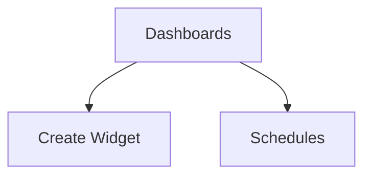

# Wireframe — Analytics

Low-fi:
```
+-------------------------------+
| Analytics                     |
+-------------------------------+
| Dashboard: Attendance         |
| [Add Widget] [Schedule]       |
| Widgets: cards/charts         |
+-------------------------------+
```
