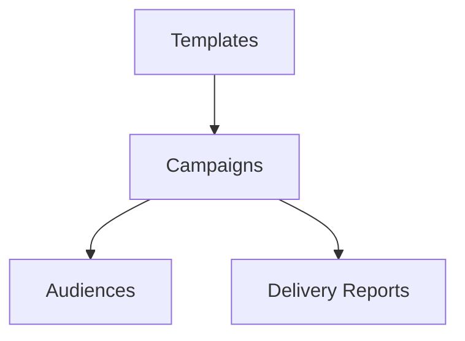

# Wireframe — Communications

Low-fi:
```
+-------------------------------+
| Communications                |
+-------------------------------+
| Templates [Add]               |
| Campaigns [New Campaign]      |
| Audiences [Filters]           |
| Delivery Reports              |
+-------------------------------+
```
