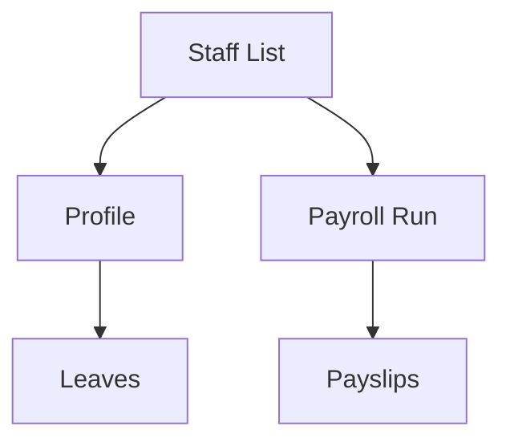

# Wireframe — HR & Payroll

Low-fi:
```
+-------------------------------+
| HR: Payroll                   |
+-------------------------------+
| [Run Payroll]  Period: Apr    |
| Payslips ▸ list with status   |
+-------------------------------+
```
