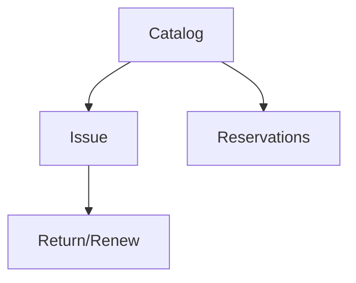

# Wireframe — Library

Low-fi:
```
+-------------------------------+
| Library                       |
+-------------------------------+
| Catalog [Search][Add]         |
| Loans  [Issue][Return]        |
| Reservations                  |
+-------------------------------+
```
