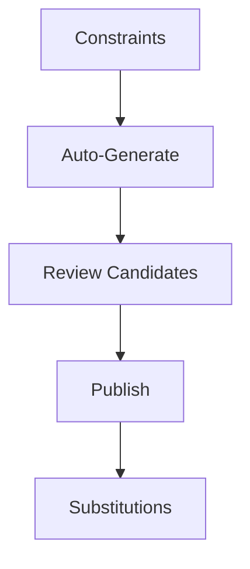

# Wireframe — Timetable & Scheduling

Low-fi:
```
+-------------------------------+
| Timetable                     |
+-------------------------------+
| [Constraints] [Auto-Generate] |
| Candidates: Plan A | Plan B   |
| [Publish]                      |
| Substitutions: [Create]       |
+-------------------------------+
```
