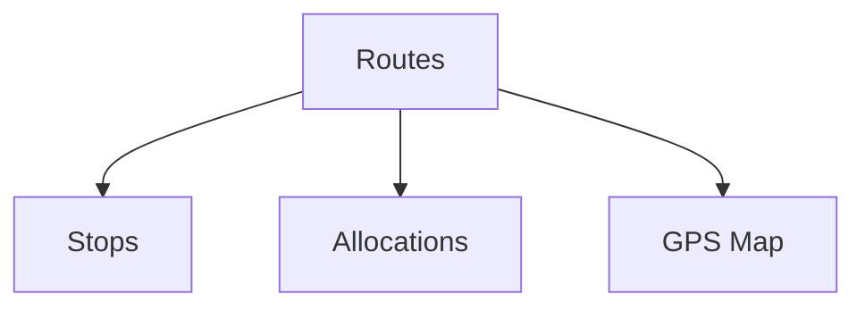

# Wireframe — Transport

Low-fi:
```
+-------------------------------+
| Transport                     |
+-------------------------------+
| Routes ▸  [Add]               |
| Stops  ▸  [Add]               |
| Allocations ▸ [Assign]        |
| GPS Map ▸                     |
+-------------------------------+
```
