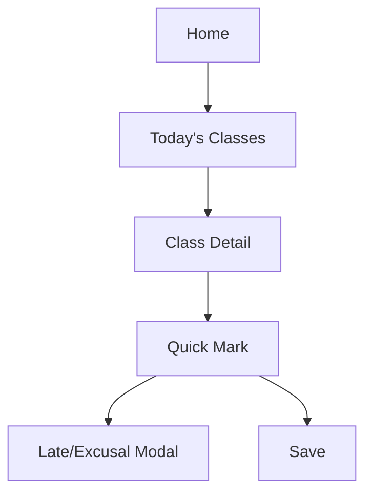

# Wireframe — Teacher Attendance (Mobile)



Low-fi (mobile):
```
+-----------------------------+
| AppBar: Attendance          |
+-----------------------------+
| Today: 10:00-10:40 Math 8A  |
| [Open]                      |
+-----------------------------+
| Quick Mark: 8A              |
| [All Present]               |
| --------------------------- |
| 01 Aditi   [P] [A] [L] [E]  |
| 02 Bharat  [P] [A] [L] [E]  |
| 03 Chetan  [P] [A] [L] [E]  |
| ...                         |
| [Save]  [Late/Excusal]      |
+-----------------------------+
```

Notes:
- Offline banner when disconnected; shows sync state per row.
- Tapping A opens reason picker; Save returns to class list with success toast.
