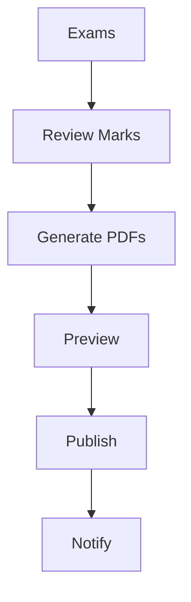

# Wireframe — Exams Publish (Admin)



Low-fi:
```
+----------------------------------+
| Exams: Term 1                    |
+----------------------------------+
| [Sessions] [Marks] [Moderation]  |
| Report Cards:                    |
| [Generate PDFs]                  |
| Preview: □ □ □ □                 |
| [Publish]  [Notify Parents]      |
+----------------------------------+
```
