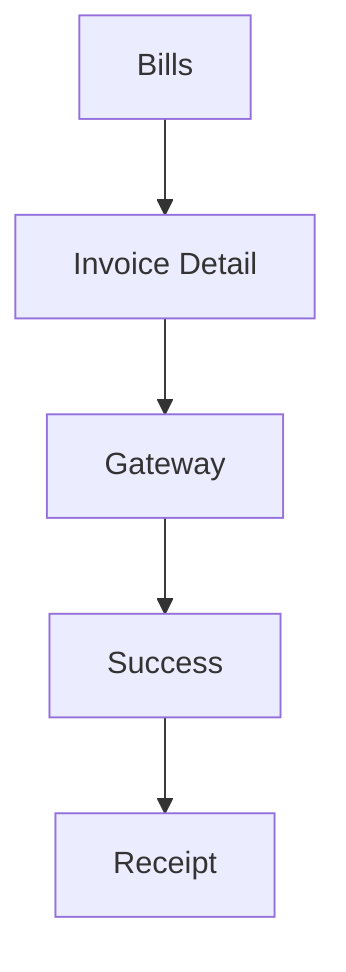

# Wireframe — Parent Fees (Web/Mobile)



Low-fi:
```
+------------------------------+
| AppBar: Bills                |
+------------------------------+
| Invoice #INV-2025-0001       |
| Due: 2025-04-30  Amount: ₹15k|
| Items: Tuition, Transport... |
| [Pay Now]                    |
+------------------------------+
| Gateway → UPI/Card/Netbank   |
+------------------------------+
| Success ✔                    |
| Receipt sent to email/SMS    |
+------------------------------+
```
