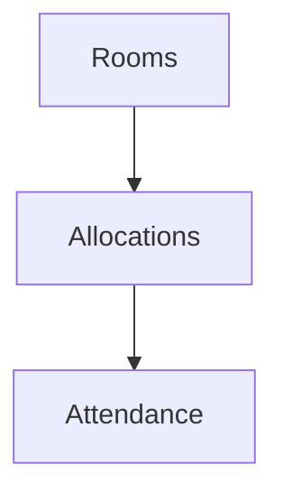

# Wireframe — Hostel

Low-fi:
```
+-------------------------------+
| Hostel                        |
+-------------------------------+
| Rooms  [Add]                  |
| Occupancy map                 |
| Allocations [Assign]          |
+-------------------------------+
```
