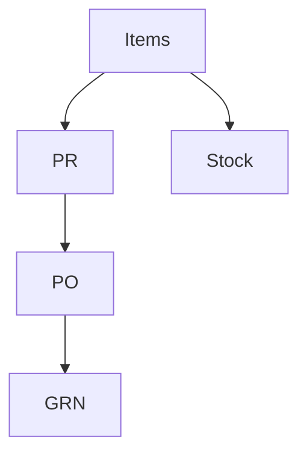

# Wireframe — Inventory & Procurement

Low-fi:
```
+-------------------------------+
| Inventory                     |
+-------------------------------+
| Items [Add]                   |
| PR ▸  PO ▸  GRN ▸             |
| Stock Ledger                  |
+-------------------------------+
```
