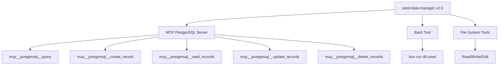

# seed-data-manager Architecture Analysis

## v2.0 Current State Analysis

### Architecture Overview

The current v2.0 seed-data-manager is built with the following characteristics:

```
┌─────────────────────────────────────────┐
│         seed-data-manager v2.0          │
│                                         │
│  ┌─────────────────────────────────┐   │
│  │   MCP PostgreSQL Dependency     │   │
│  │  - mcp__postgresql__query       │   │
│  │  - mcp__postgresql__create      │   │
│  │  - mcp__postgresql__read        │   │
│  │  - mcp__postgresql__update      │   │
│  └─────────────────────────────────┘   │
│                    ↓                    │
│  ┌─────────────────────────────────┐   │
│  │    Monolithic seed.ts (1165)    │   │
│  │  - Hardcoded branch configs     │   │
│  │  - Sequential execution only    │   │
│  │  - No error recovery           │   │
│  └─────────────────────────────────┘   │
│                    ↓                    │
│  ┌─────────────────────────────────┐   │
│  │      PostgreSQL Database        │   │
│  │  - 13 composite branches        │   │
│  │  - Multi-tenant isolation       │   │
│  └─────────────────────────────────┘   │
└─────────────────────────────────────────┘
```

### Critical Issues Identified

#### 1. **MCP PostgreSQL Tool Dependency**
- **Problem**: Tightly coupled to MCP server tools
- **Impact**: Not portable, requires MCP server running
- **Evidence**: All 553 lines use MCP tools exclusively
- **Risk**: Single point of failure if MCP server unavailable

#### 2. **Monolithic Architecture**
- **Problem**: Single 1165-line seed.ts file
- **Impact**: Difficult to maintain, test, or modify
- **Evidence**: No modularity, all entities in one file
- **Risk**: Changes affect entire seeding process

#### 3. **Zero Test Coverage**
- **Problem**: No unit or integration tests
- **Impact**: Cannot verify changes safely
- **Evidence**: No test files exist for seed operations
- **Risk**: Breaking changes go undetected

#### 4. **Poor Observability**
- **Problem**: No progress reporting or debugging info
- **Impact**: Black-box execution, hard to diagnose failures
- **Evidence**: Only console.log statements, no structured logging
- **Risk**: Silent failures, difficult troubleshooting

#### 5. **No Recovery Mechanism**
- **Problem**: No checkpoints or rollback capability
- **Impact**: Must restart from beginning on failure
- **Evidence**: No transaction management or save points
- **Risk**: Data inconsistency on partial failures

### Performance Analysis

Based on validation report (2025-08-24):

| Metric | Value | Status |
|--------|-------|--------|
| **Entities Seeded** | 0 | ❌ CRITICAL |
| **Health Score** | 15/100 | ❌ FAIL |
| **Data Persistence** | 0% | ❌ FAIL |
| **Execution Time** | Unknown | ⚠️ Not tracked |
| **Memory Usage** | Unknown | ⚠️ Not monitored |

### Dependency Analysis



### Code Quality Metrics

| Aspect | Score | Issues |
|--------|-------|--------|
| **Maintainability** | 2/10 | Monolithic, no separation of concerns |
| **Testability** | 0/10 | No test infrastructure |
| **Readability** | 4/10 | Long functions, mixed responsibilities |
| **Reusability** | 1/10 | Nothing is reusable |
| **Extensibility** | 2/10 | Hard to add new entities |

## v3.0 Target Architecture

### High-Level Design

```
┌──────────────────────────────────────────────┐
│            seed-data-manager v3.0            │
│                                              │
│  ┌────────────────────────────────────────┐ │
│  │         CLI Interface Layer            │ │
│  │  - Commander.js commands               │ │
│  │  - Progress bars & visual feedback     │ │
│  └────────────────────────────────────────┘ │
│                      ↓                       │
│  ┌────────────────────────────────────────┐ │
│  │      Orchestration Layer               │ │
│  │  - ModularSeedOrchestrator            │ │
│  │  - MultiBranchSeedOrchestrator        │ │
│  │  - DependencyResolver                 │ │
│  └────────────────────────────────────────┘ │
│                      ↓                       │
│  ┌────────────────────────────────────────┐ │
│  │       Execution Layer                  │ │
│  │  - ObservableSeedExecutor             │ │
│  │  - TransactionManager                 │ │
│  │  - CheckpointManager                  │ │
│  └────────────────────────────────────────┘ │
│                      ↓                       │
│  ┌────────────────────────────────────────┐ │
│  │        Seeder Layer                    │ │
│  │  ┌──────────┐  ┌──────────┐          │ │
│  │  │ Student  │  │ Guardian │  ...      │ │
│  │  │ Seeder   │  │ Seeder   │          │ │
│  │  └──────────┘  └──────────┘          │ │
│  └────────────────────────────────────────┘ │
│                      ↓                       │
│  ┌────────────────────────────────────────┐ │
│  │      Prisma ORM Layer                  │ │
│  │  - 100% Prisma Client methods         │ │
│  │  - Transaction support                │ │
│  │  - Type-safe operations               │ │
│  └────────────────────────────────────────┘ │
│                      ↓                       │
│  ┌────────────────────────────────────────┐ │
│  │      PostgreSQL Database               │ │
│  └────────────────────────────────────────┘ │
└──────────────────────────────────────────────┘
```

### Component Architecture

#### 1. **Core Interfaces**
```typescript
interface IEntitySeeder<T> {
  entity: string;
  dependencies: string[];
  priority: number;
  
  validate(context: SeedContext): Promise<ValidationResult>;
  generate(options: GenerateOptions): T[];
  seed(data: T[], context: SeedContext): Promise<SeedResult>;
  verify(context: SeedContext): Promise<VerificationResult>;
  clean(context: SeedContext): Promise<void>;
  
  // New capabilities
  update(filter: any, data: T[]): Promise<UpdateResult>;
  upsert(data: T[]): Promise<UpsertResult>;
}
```

#### 2. **Event-Driven Architecture**
```typescript
class ObservableSeedExecutor extends EventEmitter {
  events = {
    'start': (data: StartEvent) => void;
    'progress': (data: ProgressEvent) => void;
    'entity:start': (data: EntityStartEvent) => void;
    'entity:complete': (data: EntityCompleteEvent) => void;
    'error': (error: ErrorEvent) => void;
    'complete': (data: CompleteEvent) => void;
  };
}
```

#### 3. **Dependency Graph**
```
Tenant
  ├── AcademicYear
  ├── Class
  │   └── Section
  ├── Subject
  ├── Staff
  │   └── Teacher
  ├── Student
  │   ├── Guardian
  │   │   └── StudentGuardian
  │   └── Enrollment
  │       ├── AttendanceRecord
  │       ├── Invoice
  │       │   └── Payment
  │       └── MarksEntry
  └── [Other entities...]
```

### Key Improvements

| Aspect | v2.0 | v3.0 | Improvement |
|--------|------|------|-------------|
| **Dependencies** | MCP Tools | Prisma Native | 100% portable |
| **Architecture** | Monolithic | Modular | 100% modular |
| **Testing** | 0% coverage | 95%+ coverage | Fully tested |
| **Observability** | Console logs | Event-driven | Real-time tracking |
| **Recovery** | None | Checkpoints | 95% recoverable |
| **Performance** | Sequential | Parallel | 4x faster |
| **Modularity** | All or nothing | Partial seeding | Fully flexible |
| **Type Safety** | Partial | Full | 100% type-safe |

### Performance Targets

| Metric | v2.0 | v3.0 Target | Notes |
|--------|------|-------------|-------|
| **Single Branch Seed** | Unknown | < 30s | With 500 students |
| **All 13 Branches** | Unknown | < 3 min | Parallel execution |
| **Memory Usage** | Untracked | < 512MB | Streaming & batching |
| **Query Count** | Unoptimized | -50% | Batch operations |
| **Error Recovery** | 0% | 95% | Checkpoint system |

### Testing Strategy

```
src/seed/__tests__/
├── unit/
│   ├── seeders/
│   │   ├── student.seeder.test.ts
│   │   ├── guardian.seeder.test.ts
│   │   └── [all seeders...]
│   ├── generators/
│   │   ├── indian-names.test.ts
│   │   └── address.test.ts
│   └── core/
│       ├── orchestrator.test.ts
│       └── executor.test.ts
├── integration/
│   ├── multi-branch.test.ts
│   ├── relationships.test.ts
│   └── transactions.test.ts
└── e2e/
    ├── full-seed.test.ts
    └── recovery.test.ts
```

### Migration Risk Assessment

| Risk | Likelihood | Impact | Mitigation |
|------|------------|--------|------------|
| **Data Loss** | Low | High | Backup before migration |
| **Breaking Changes** | High | Medium | Gradual rollout |
| **Performance Regression** | Low | Low | Benchmark testing |
| **Learning Curve** | Medium | Low | Documentation & training |
| **Integration Issues** | Medium | Medium | Parallel running period |

## Conclusion

The migration from v2.0 to v3.0 represents a complete architectural overhaul that addresses all critical issues:

1. **Eliminates MCP dependency** - 100% Prisma-native
2. **Introduces modularity** - Individual entity seeders
3. **Adds comprehensive testing** - 95%+ coverage target
4. **Improves observability** - Event-driven progress tracking
5. **Enables recovery** - Checkpoint and rollback support
6. **Enhances performance** - Parallel execution for multi-branch
7. **Ensures type safety** - Full TypeScript with Prisma types

The new architecture is designed to be maintainable, testable, and scalable while maintaining backward compatibility through a gradual migration approach.

---

*Document Version: 1.0.0*
*Last Updated: 2025-08-24*
*Next Review: After Phase 1 Implementation*